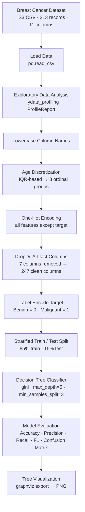
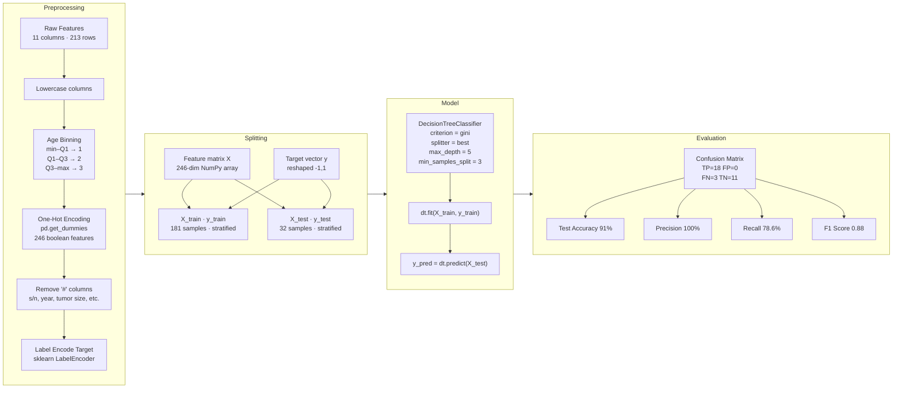
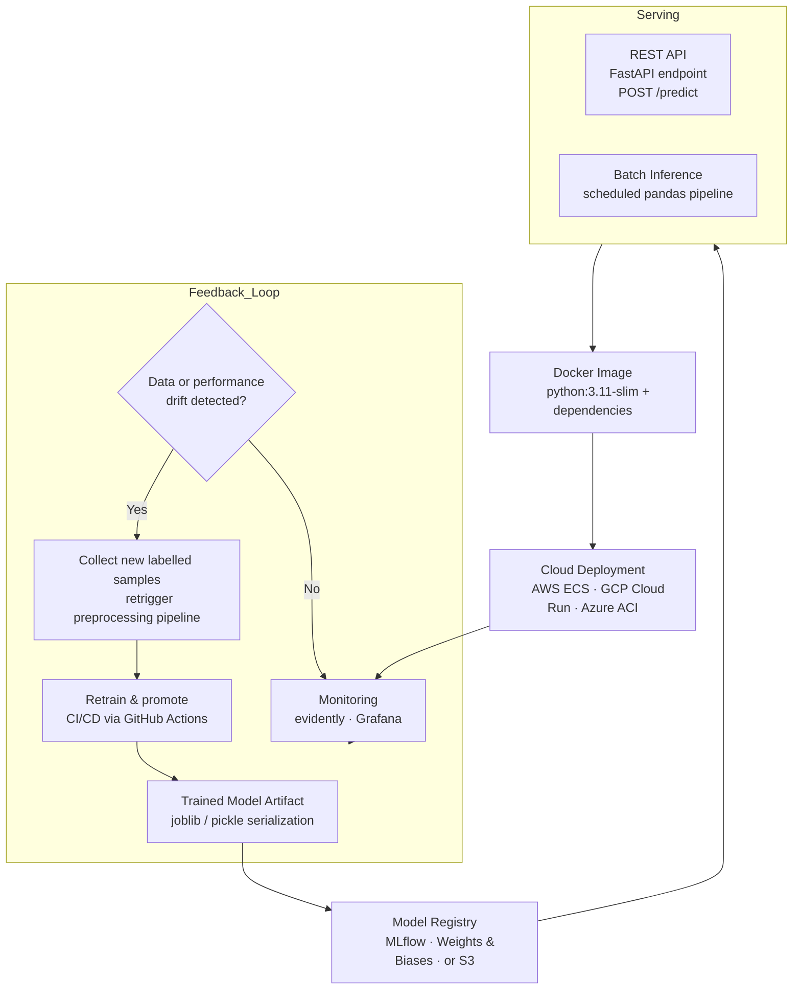

# Decision Tree Prediction

A Decision Tree classifier that predicts breast cancer diagnosis (Benign vs. Malignant) from clinical features. Built as part of a supervised machine learning study using a 213-record breast cancer dataset.

---

## End-to-End Workflow



---

## Predictive Modeling Strategy



### Key Design Decisions

| Decision | Choice | Reason |
|---|---|---|
| Age encoding | Ordinal bins (IQR) | Preserves natural ordering; reduces cardinality before OHE |
| OHE strategy | `drop_first=False` | Retains all categories for interpretability in the tree |
| Splitting criterion | Gini impurity | Standard for classification; computationally efficient |
| Test size | 15% stratified | Small dataset (213 rows); stratification preserves class ratio (56% Benign / 44% Malignant) |
| max_depth | 5 | Limits overfitting on a shallow dataset |

---

## Deployment Roadmap



### Deployment Milestones

- [ ] Serialize trained model with `joblib`
- [ ] Wrap prediction logic in a FastAPI `/predict` endpoint
- [ ] Containerize with Docker; validate locally
- [ ] Push image to ECR / Artifact Registry and deploy
- [ ] Attach evidently dashboard for feature drift and accuracy tracking
- [ ] Wire retraining trigger into GitHub Actions on drift alert

---

## Project Structure

```
zaed_ml_project/
├── dt_model.ipynb              # Exploratory notebook with full output
├── preprocessing.py            # Refactored pipeline script
├── tree_visual_homework_3.png  # Rendered decision tree
├── requirements.txt            # Python dependencies
└── README.md
```

---

## Setup

### Prerequisites

- Python 3.11+
- [uv](https://docs.astral.sh/uv/) — fast Python package and environment manager

Install `uv` if you don't have it:

```bash
curl -LsSf https://astral.sh/uv/install.sh | sh
```

### Create and activate the virtual environment

```bash
# Create a .venv in the project root
uv venv

# Activate (macOS / Linux)
source .venv/bin/activate

# Activate (Windows)
.venv\Scripts\activate
```

### Install dependencies

```bash
uv pip install -r requirements.txt
```

> **Note:** `requirements.txt` includes `torch`. If you only need the scikit-learn pipeline and want a lighter install, you can skip it:
>
> ```bash
> uv pip install pandas numpy scikit-learn ydata-profiling ipykernel ipywidgets graphviz
> ```

### Run the notebook

```bash
jupyter notebook dt_model.ipynb
```

### Run the script

```bash
python preprocessing.py
```

---

## Results Summary

| Split | Accuracy | Precision | Recall | F1 |
|---|---|---|---|---|
| Test  (32 samples) | 91.0% | 1.00 | 0.786 | 0.88 |
| Train (181 samples) | 96.7% | 1.00 | 0.924 | 0.961 |

The zero false positives on the test set (Precision = 1.0) mean every predicted Malignant case was correct. The gap between train and test recall (0.924 vs 0.786) indicates mild overfitting — addressable with cross-validation or pruning.

---

## Dataset

| Field | Detail |
|---|---|
| Source | Private S3 bucket (CSV) |
| Records | 213 |
| Features | Age, Menopause, Tumor Size, Inv-Nodes, Breast, Metastasis, Breast Quadrant, History |
| Target | Diagnosis Result — Benign / Malignant |
| Class balance | 120 Benign (56%) · 93 Malignant (44%) |
